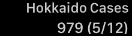
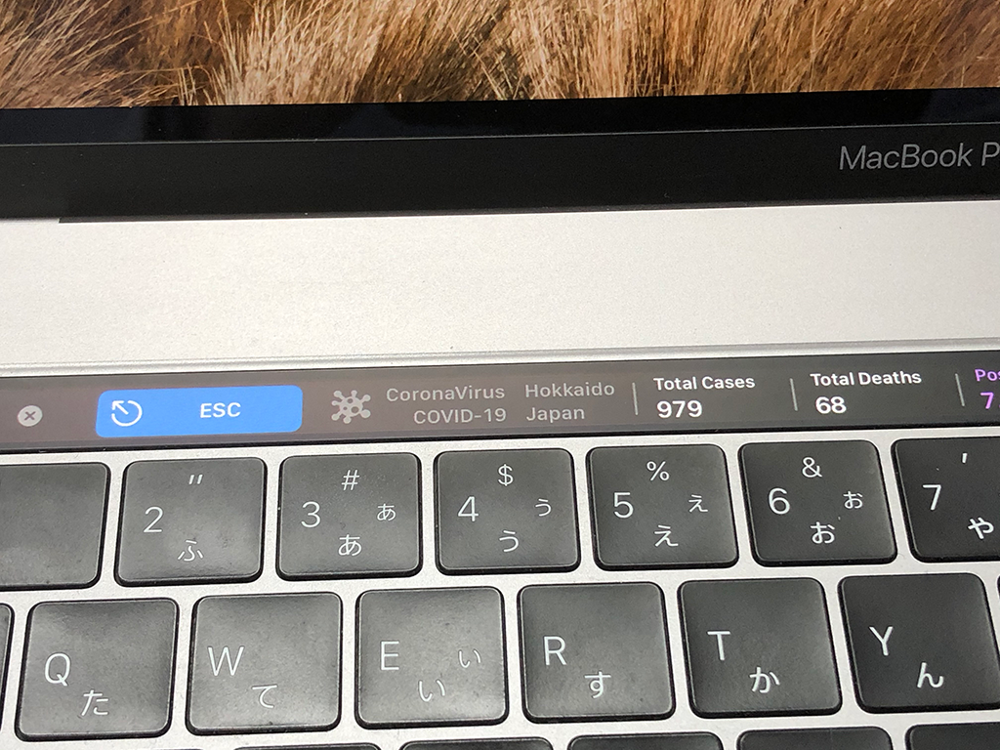

# 概要

MacBook Pro の Touch Bar に北海道の新型コロナウイルス情報を表示します。

# 動作イメージ

- タッチバーグループ
  - 陽性累計
  - 更新日付 (月/日)

- グループに表示される内容
  - [北海道 新型コロナウイルスまとめサイト](https://stopcovid19.hokkaido.dev/)
  - リージョン名の表示
  - 陽性累計
  - 死亡累計
  - 陽性率%
  - 日陽性数
  - 日死亡数

## 実機イメージ

# 動作確認

- macOS Catalina 10.15.4
- BetterTouchTool 3.372

# データソース

北海道オープンデータポータル  
https://www.harp.lg.jp/opendata/dataset/1369.html

データソース  
https://www.harp.lg.jp/opendata/dataset/1369/resource/2853/covid19_data.csv

# 参考

CoronaVirus COVID-19 Statistics in TouchBar  
https://community.folivora.ai/t/coronavirus-covid-19-statistics-in-touchbar/14817
